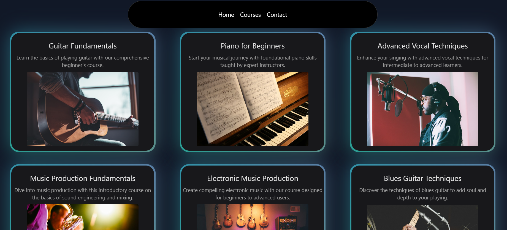
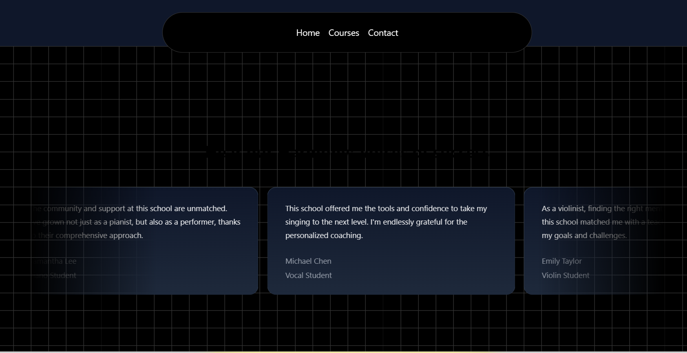

### Project Title: Music School Animated Website

#### Description:
This project is an animated and interactive Music School website built with Next.js 14, Tailwind CSS, Aceternity UI, and TypeScript. It aims to provide a rich user experience by incorporating modern web technologies and design principles to create an engaging and intuitive platform for users.

#### Key Features:
- **Next.js 14**: Utilized for its powerful features such as server-side rendering, static site generation, and API routes, ensuring fast load times and a seamless browsing experience.
- **Tailwind CSS**: Employed to create a highly customizable and responsive design. Tailwind CSS allows for rapid UI development with utility-first CSS classes, ensuring consistency and maintainability.
- **Aceternity UI**: Integrated for sophisticated and elegant UI components. Aceternity UI provides a set of pre-designed, highly customizable components that enhance the visual appeal and functionality of the website.
- **TypeScript**: Implemented to add static typing to JavaScript, which helps catch errors early in the development process and improves code quality and maintainability.

  

    
  

  

    
  

  

    
  

  

    
  

#### Project Objectives:
- To provide an intuitive and visually appealing platform for prospective and current music students.
- To streamline navigation and content accessibility with a user-friendly interface.
- To showcase the features and benefits of the music school through engaging animations and interactive elements.

#### Usage:
This website can serve as an online portal for music schools to present their courses, instructors, and events. It offers real-time updates, collaborative editing, and seamless version control, making it an ideal solution for educational institutions looking to enhance their digital presence.

#### Technologies Used:
- **Next.js 14**: For building the React-based front end and handling server-side rendering.
- **Tailwind CSS**: For designing the layout and styling the components.
- **Aceternity UI**: For utilizing pre-built UI components and enhancing the user interface.
- **TypeScript**: For improving code quality and adding type safety to the JavaScript code.

This project demonstrates a modern approach to web development, combining the latest frameworks and libraries to create a dynamic and user-friendly educational platform.
